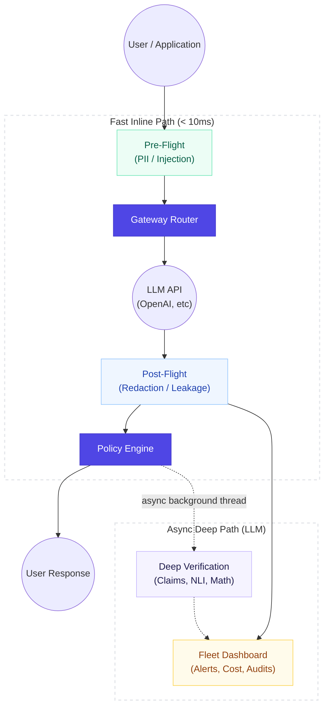

<p align="center">
  
  
  
  
  
</p>

<h1 align="center">🛡️ ControlPlane</h1>
<h3 align="center">Enterprise AI Governance Gateway for LLM Reliability & Cost Control</h3>
<p align="center"><i>Catching hallucinations, preventing data leakage, and halting budget drift — with zero latency.</i></p>

---

## 📋 Table of Contents

1.  [Problem Statement](#-problem-statement)
2.  [Our Solution — ControlPlane](#-our-solution--controlplane)
3.  [Key Differentiator — Two-Path Architecture](#-key-differentiator--two-path-architecture)
4.  [System Architecture](#-system-architecture)
5.  [Tech Stack](#-tech-stack)
6.  [Getting Started — Installation & Setup](#-getting-started--installation--setup)
7.  [Usage & Integration](#-usage--integration)
8.  [The 4-Phase Execution Flow](#-the-4-phase-execution-flow)
9.  [Project Structure](#-project-structure)

---

## 🎯 Problem Statement

> **Operational Challenge:** Organizations are embedding Large Language Models (LLMs) into critical products faster than they can govern them. Deploying models into production today means flying blind.

### Why It's Hard Today

| Failure Mode | Description |
|---|---|
| **Hallucinations** | LLMs state false information with perfect confidence. Rule-based filters cannot catch semantic falsehoods, meaning users have zero signal that anything is wrong until real damage is done. |
| **Data Leakage** | Sensitive information (PII, API keys, patient records) passed into prompts can be silently reproduced by the LLM and sent to unintended destinations (like unencrypted chat logs). |
| **Cost Unpredictability** | Token usage and inference spend drift silently. Anomalies aren't caught in real-time; most teams only discover a rogue script when the monthly cloud bill arrives. |

### The Core Question We Solve

> **How can we intercept, audit, and fact-check every single LLM interaction in real-time, preventing data leaks and tracking costs, without adding 10 seconds of latency to the user experience?**

---

## 💡 Our Solution — ControlPlane

**ControlPlane** is a full-stack, model-agnostic proxy gateway. It sits seamlessly between your application and any LLM provider (OpenAI, Anthropic, etc.). 

We completely bypass the traditional dilemma of "Security vs. Speed" by deploying a **Two-Path Processing Architecture**.

### What Makes Us Different

We don't just output a vague "safety score 0.8". We execute concrete actions.

```
┌─────────────────────┐     ┌──────────────────────┐     ┌─────────────────────────┐     ┌──────────────────────┐
│  1. PRE-FLIGHT       │ ──▶ │  2. INLINE POLICY    │ ──▶ │  3. POST-FLIGHT         │ ──▶ │  4. ASYNC VERIFY      │
│  Scan prompt for     │     │  Route to LLM,       │     │  Auto-redact leaked     │     │  Background LLM      │
│  PII & Injection     │     │  Calculate Cost      │     │  secrets before delivery│     │  fact-checks claims  │
└─────────────────────┘     └──────────────────────┘     └─────────────────────────┘     └──────────────────────┘
```

1.  **Fast Deterministic Rules** — All blocking and redacting happens inline using zero-LLM regex and statistical baselines (< 10ms).
2.  **Tool-Aware Verification** — We don't use LLMs to verify math. We use a deterministic `sympy` calculator.
3.  **Actionable Policy** — The engine explicitly returns `ALLOW`, `ANNOTATE`, `REDACT`, `BLOCK`, or `ESCALATE`.

---

## ⭐ Key Differentiator — Two-Path Architecture

While most AI security tools put heavy LLM-based fact-checkers directly in front of the user—destroying the app's latency—we split the pipeline.

### The Fast Inline Path (Zero Latency)
Before the response hits the user, it runs through deterministic scanners. If a user pastes an API key and the LLM spits it back out, our **Data Lineage Tracker** flags it. Our **Auto-Redactor** instantly replaces it with `[REDACTED_API_KEY]`. The user gets a safe response instantly.

### The Async Deep Path (LLM-Powered)
*After* the user gets their answer, a background thread wakes up. 
1. **Extract**: A fast LLM breaks the response into factual claims.
2. **Retrieve**: We fetch evidence from Knowledge Bases, web search, or a math engine.
3. **Entail**: An NLI classifier scores each claim as `SUPPORTED` or `CONTRADICTED`.
4. **Dashboard**: The results retroactively populate the Fleet Dashboard, alerting operators to hallucinations.

---

## 🏗 System Architecture



---

## 💻 Tech Stack

- **Backend Gateway:** `Python 3.10+`, `FastAPI`, `Uvicorn`
- **Data & Telemetry:** `SQLite` (Local event storage), Statistical P50/P90 baselines
- **Verification Engine:** `Sympy` (Math Verification), `Groq API` (Fast Async Claim Extraction)
- **Frontend Dashboard:** `React 18`, `Vite`, `Recharts` (Analytics), `Vanilla CSS`

---

## 🚀 Getting Started — Installation & Setup

### Prerequisites
- Python 3.10+
- Node.js v18+
- OpenAI API Key (For the core LLM)
- Groq API Key (For the async verification models)

### 1. Booting the Backend

The backend is built with FastAPI and runs on port `8000`.

```bash
# Navigate to the backend directory
cd controlplane

# Create and activate a virtual environment
python -m venv venv
source venv/bin/activate  # On Windows use: .\venv\Scripts\activate

# Install dependencies
pip install -r requirements.txt

# Set up Environment Variables in a .env file
echo "GROQ_API_KEY=gsk_your_groq_key" > .env
echo "OPENAI_API_KEY=sk-your_openai_key" >> .env

# Start the gateway server
python -m uvicorn gateway.main:app --reload --port 8000
```

### 2. Booting the Frontend Dashboard

The Operator Dashboard runs on port `5173`. Open a **new terminal window**.

```bash
# Navigate to the dashboard directory
cd controlplane/dashboard

# Install Node dependencies
npm install

# Start the Vite development server
npm run dev
```

---

## 🔌 Usage & Integration

### Testing the Dashboard

1. Open your browser to `http://localhost:5173` to see the Fleet Overview.
2. Click on **Playground** in the sidebar.
3. Send a test query containing an API key or a math problem.
4. Click **View Event Log** on your query. Watch the Deep Verification Claim Timeline populate and the auto-redaction take effect.

### Integrating with Your Own App

To route your existing application traffic through ControlPlane, simply change the `base_url` of your standard LLM client.

**Before:**
```python
client = OpenAI(api_key="your-api-key")
```

**After:**
```python
client = OpenAI(
    base_url="http://localhost:8000/v1",
    api_key="your-api-key" # We pass this straight through to the LLM
)
```
> **Zero Code Changes:** Every request is now audited, tracked for costs, and verified for hallucinations automatically.

---

## ⚙️ The 4-Phase Execution Flow

1. **Phase 1 (Pre-Flight):** PII scanning and prompt injection detection occur.
2. **Phase 2 (Gateway):** Request goes to the LLM. Cost is calculated instantly based on token counts.
3. **Phase 3 (Post-Flight):** Auto-redaction of secrets. Data Lineage compares the prompt PII to the output. The Policy Engine executes a final action (`ALLOW`, `REDACT`, `BLOCK`).
4. **Phase 4 (Async Verification):** Claims are extracted, evidence retrieved, and NLI entailment scored. Dashboard is updated.

---

## 📁 Project Structure

```text
controlplane/
├── dashboard/             # React/Vite operator dashboard frontend
├── data/                  # Local SQLite database (events.db)
├── deep_checks/           # Async LLM-powered verification (claims, NLI, math)
├── fast_checks/           # Deterministic inline scanners (PII, injection)
├── gateway/               # FastAPI routing and request handling
├── human_review/          # Human-in-the-loop review queue logic
├── policy/                # Policy engine (Allow, Annotate, Redact, Block, Escalate)
├── responsibility/        # Data lineage tracking and auto-redaction
└── telemetry/             # Cost baselines, trend detection, and event storage
```
